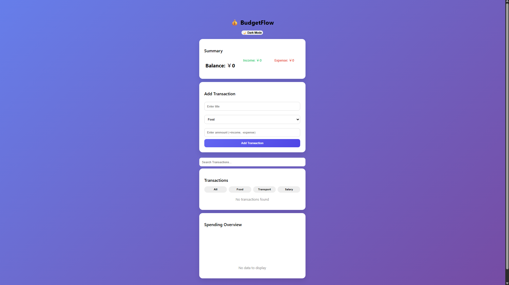

# 💰 BudgetFlow - Expense Tracker

A simple and responsive expense tracking web app built with vanilla JavaScript.

---

## 🚀 Features
- Add, edit, and delete transactions
- Category filtering and search
- Real-time balance calculation
- Interactive doughnut chart (by category)
- Data saved using LocalStorage
- Dark mode toggle 🌙
- Responsive and modern UI

---

## 🛠️ Tech Stack
- HTML
- CSS
- JavaScript
- Chart.js

---

## 🌐 Live Demo
[View the live app](https://kkato0219.github.io/expense-tracker-app/)

---

## 📸 Screenshot

---

## 📚 What I Learned
- Managing application state with JavaScript
- DOM manipulation and event handling
- Using Chart.js for data visualization
- Working with LocalStorage for persistence
- Improving UI/UX with features like dark mode and animations

---

## 💡 Future Improvements
- Export transactions to CSV
- Monthly summary view
- Better mobile responsiveness
- User authentication (login system)

---

## 🙌 Author
Kenichi Kato
