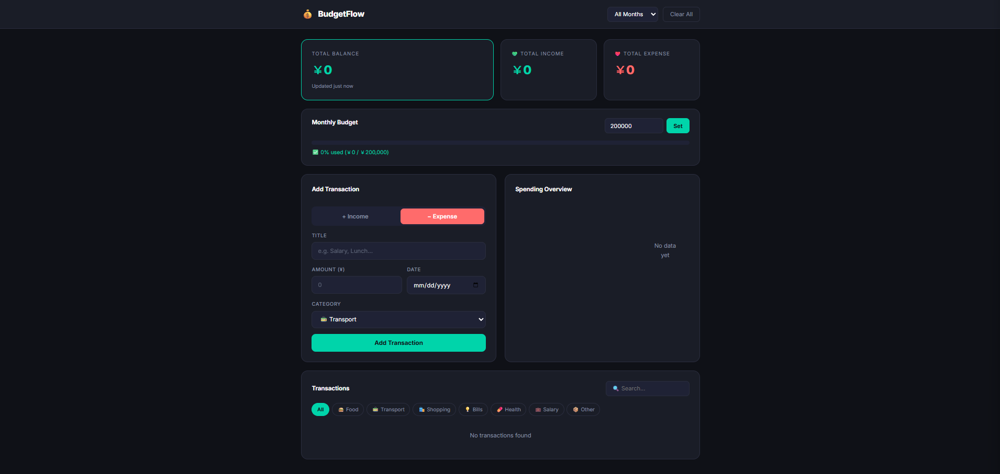

# BudgetFlow — Expense Tracker App

A modern personal finance dashboard built 
with HTML, CSS, and JavaScript.

## Live Demo
https://kkato0219.github.io/expense-tracker-app/

## Screenshots

## Features
- Income / Expense toggle button
- Add transactions with title, amount, date, category
- 7 categories (Food, Transport, Shopping, Bills, Health, Salary, Other)
- Doughnut chart for spending overview
- Filter by category
- Filter by month
- Search transactions
- Edit and delete transactions
- Monthly budget setting with progress bar
- Budget warning (yellow at 80%, red at 100%)
- localStorage persistence
- Fully responsive design

## Technologies Used
- HTML5
- CSS3
- JavaScript (Vanilla)
- Chart.js
- Google Fonts (Inter)
- CSS Grid
- Flexbox
- localStorage API

## What I Learned
- DOM manipulation with querySelector
- Event listeners
- Array methods (forEach, filter, reduce, find)
- Object.keys / Object.values
- localStorage save and load
- Chart.js doughnut chart
- Dynamic CSS with classList
- Form validation